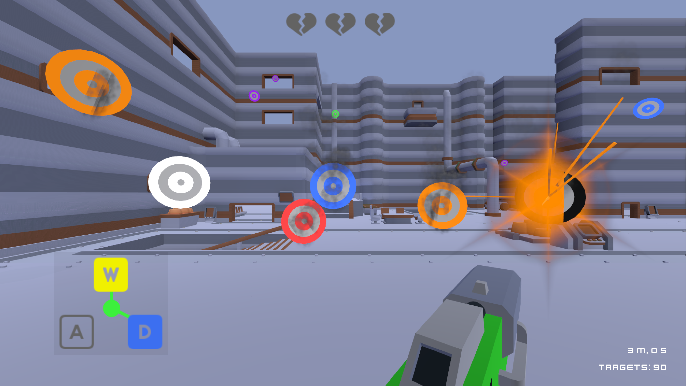

# Primary Connection - Kenney Jam 2024

Survive an endless onslaught of coloured targets for as long as you can. Targets can only be destroyed by their respective colour, so act fast and aim true!

Created for KenneyJam 2024 with Godot 4.2 and published [here on itch.io](https://sundowns.itch.io/primary-connection)

## Controls

- [A, W, D] Toggle primary colours
- [MOUSE1] Shoot

## Attributions

- Music is `Maximalism` by [Punch Deck](https://www.chosic.com/free-music/all/?keyword=Punch%20Deck&artist), licensed under Creative Commons CC BY 3.0

- All other assets were created by [Kenney](https://kenney.nl/)
